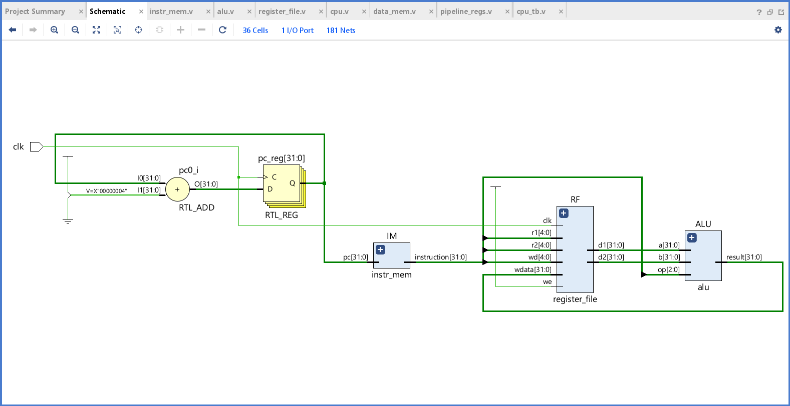
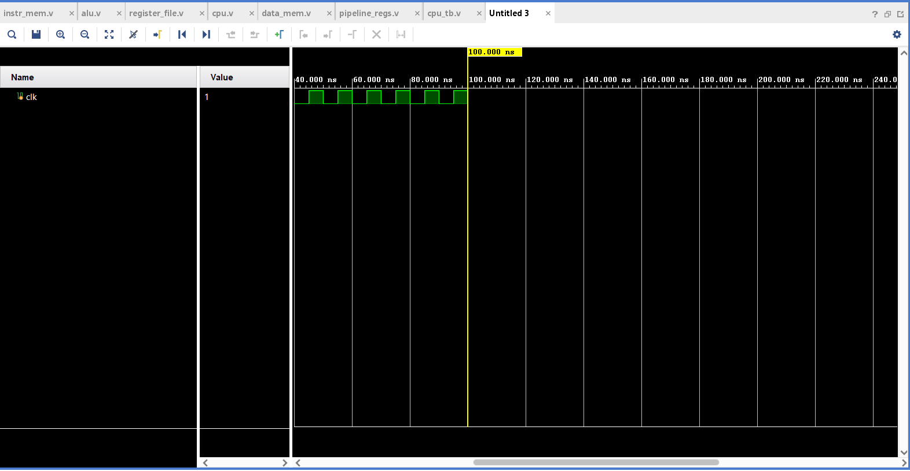

# 4-Stage Pipelined Processor (Verilog)

This project demonstrates a basic 4-stage pipelined processor capable of handling basic instructions like `ADD`, `SUB`, and `LOAD`.

---

## 📌 Pipeline Stages
1. **Instruction Fetch (IF)**
2. **Instruction Decode (ID)**
3. **Execution (EX)**
4. **Write Back (WB)**

---

## 🧠 Supported Instructions
- `ADD R1, R2, R3`
- `SUB R4, R5, R6`
- `LOAD R7, [16]`

---

## 📁 File Descriptions
| File | Description |
|------|-------------|
| `cpu.v` | Main processor module |
| `cpu_tb.v` | Testbench for simulation |
| `instr_mem.v` | Instruction memory |
| `register_file.v` | CPU registers |
| `data_mem.v` | Data memory |
| `alu.v` | Arithmetic Logic Unit |
| `pipeline_regs.v` | Pipeline register stage logic |

---

## 🖼️ Output Images

### 🔍 RTL Schematic View

### 🔬 Simulation Output

---

## 🚀 Run Instructions (Vivado)
1. Open Vivado and create a new project.
2. Import all `.v` files from the `src/` folder.
3. Set `cpu_tb.v` as the top module.
4. Run behavioral simulation.
5. Capture RTL and simulation images and save them in the `images/` folder.

---

## 📬 Author
Designed for academic project requirements with Vivado HDL simulation.
